CBW IMPACTT Workshop

July 5-7th, 2023

**Module 5: Metagenomic Assembly and Metagenome Assembled Genomes
Tutorial**

The purpose of this tutorial is to introduce common bioinformatics tools
for processing metagenomics datasets using an assembly-based approach
and binning to produce metagenome assembled genomes (MAGs). You will be
taken through each step of the process with a focus on developing
conceptual understanding, identifying key parameters, evaluating data
quality, and weighing analytical choices. For this tutorial we will be
using four vaginal metagenomes generated in a pilot study of baseline
samples (N=17) from participants in the Kenyan Girls Health Study
(Sycuro lab). This longitudinal cohort study enrolled adolescent girls
and young women (AGYW) aged 16–20 years old from Thika, Kenya to study
drivers of *Lactobacillus* dominance. A healthy vaginal microbiome is
dominated by a single *Lactobacillus* species, such as *L. crispatus* or
*L. iners*, which can make up anywhere from 50% to \>90% of the total
bacterial load. In contrast, a dysbiotic vaginal microbiome is
characterized by a high diversity of anaerobic bacteria such as
*Gardnerella vaginalis.* This dataset will introduce you to some of
these species once you annotate and classify the samples’ MAGs.

This dataset has been previously processed through a quality control and
filtering pipeline that ensures that sequencing adapters are removed,
read ends are trimmed to remove bases with low quality base calls, reads
that are too short or exhibiting overall low quality are removed, and
reads aligning to the human genome are removed. The pipeline we utilize
for quality filtering and host decontamination is freely available to
the public (<https://github.com/SycuroLab/metqc>), though many
well-established/stand-alone tools are available.

Our objective today is to guide you through the commands used in the
three analytical steps introduced during the lecture: 1) Assembly; 2)
Binning; and 3) Annotation. There are many steps involved in metagenome
assembly and binning that are computationally demanding, often taking
several hours to several days on a high-performance computing (HPC)
node, depending on the size of the dataset. The provided datasets are
relatively compact – representing typical shallow shotgun metagenomes –
but some steps still took up to 30 min to complete on a HPC node with 14
or 28 threads and up to 50GB RAM or higher. A server such as the AWS
instance with 8 threads and 16GB RAM will take much longer to complete
and some jobs may not complete at all. Thus, we have completed each step
beforehand and provided the output files so that you can follow along
and only carry out some of the less computationally intensive steps on
your own.

Each step that you will perform on your AWS instance in class is
highlighted in yellow. Procedural notes are indented and italicized and
critical warnings are bolded. If you wish to skip directly to the
working component of the tutorial, go to page 3.

**Overview of the Dataset and Workflow**

The KGHS dataset was downloaded from NCBI BioProject RJNA838641 (Table
1). Please see Appendix 1 for more information on how this was performed
and how to download public datasets using the NCBI SRA toolkit program
fasterq-dump.

**Table 1:** Dataset information.

| Sample Name | SRA Run ID  | Total Number of Cleaned Reads | Read Length | File Size |
|-------------|-------------|-------------------------------|-------------|-----------|
| KGHS_1-0    | SRR19237623 | 1321174                       | 2x150       | 2x370MB   |
| KGHS_8-0    | SRR19237609 | 3773184                       | 2x150       | 2x1.3GB   |
| KGHS_9-0    | SRR19237608 | 1116676                       | 2x150       | 2x450MB   |
| KGHS_15-0   | SRR19237617 | 3701058                       | 2x150       | 2x1.3GB   |

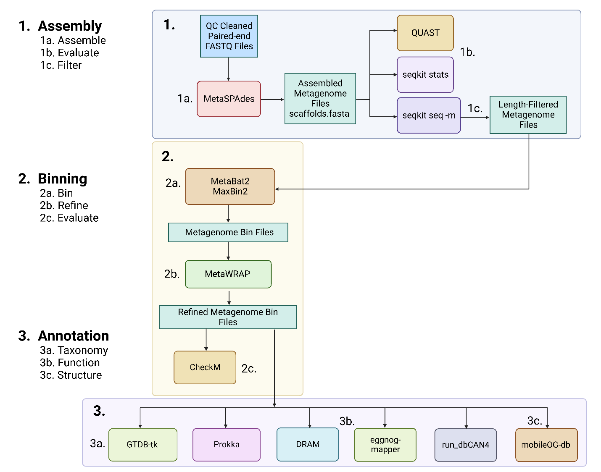

**Figure 1**: Overview of the assembly, binning, and annotation
workflow.

**Section 1: Assembly**

To get started please change your directory to the module5 folder for
this workshop using the following command;

cd
/home/ubuntu/CourseData/MIC_data/mags_workshop/module5/output

<u>Step 1a: Assemble metagenomic reads using MetaSPAdes</u>

**SPAdes** (<https://github.com/ablab/spades>)

SPAdes assembles genomes and metagenomes\[1\]. The metaspades.py command
is used to run MetaSPAdes, the version designed to operate on
metagenomic datasets.

> *The -k flag allows for a wider range of kmers to be used, which helps
> to find the most optimal assembly. We are using the following kmer
> values: -k 21,33,55,77,99,127. Must be odd numbers from 21 to 127. The
> paper used the default settings for kmer values: -k 21,33,55.*

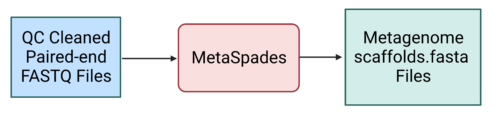

**Figure 2.** The MetaSPAdes step uses the quality control cleaned
paired end FASTQ files as input and generates a number of output files,
including the scaffolds.fasta file containing all scaffold sequences for
the metagenomic assembly.

**WARNING: DO NOT RUN MetaSPAdes!**

> *Notes: For a dataset this size (~300MB – 1.3GB per read1.fastq and
> read2.fastq), with 28 threads, MetaSPAdes ran for 17 – 27 minutes
> using 13.2GB – 17.6GB. A larger metagenome (20 GB) will typically take
> several hours to several days using these parameters. The AWS instance
> may similarly take many hours to complete if you attempt to assemble
> these data on it. For the purpose of the in-class tutorial, the output
> files are provided for you to view:  
> cd*/home/ubuntu/CourseData/MIC_data/mags_workshop/module5/output/metagenome_assemblies/KGHS_1-0
>
> *We have also provided a conda environment and commands within shell
> scripts to run MetaSPAdes, with more details in Appendix 2.*

Example command for sample KGHS_1-0:

**\# Activate the SPAdes conda environment so that you can run
MetaSPAdes.**

conda activate spades_env

**\# Execute the MetaSPAdes command using kmer lengths
21,33,55,77,99,127 to find the optimized assembly with 28 threads and
50GB RAM.**

metaspades.py -k 21,33,55,77,99,127 -t 28 -m 50 -o
metagenome_assemblies/KGHS_1-0 -1 cleaned_fastq_files/KGHS_1-0_1.fastq
-2 cleaned_fastq_files/KGHS_1-0_2.fastq

MetaSPAdes output: contains many output files, the log file, and
intermediate file directories.

Key output files:

**contigs.fasta** - The FASTA file containing the assembled metagenomic
contigs

less
/home/ubuntu/CourseData/MIC_data/mags_workshop/module5/output/metagenome_assemblies/KGHS_1-0/contigs.fasta

**scaffolds.fasta** - The FASTA file containing the assembled
metagenomic scaffolds

less
/home/ubuntu/CourseData/MIC_data/mags_workshop/module5/output/metagenome_assemblies/KGHS_1-0/scaffolds.fasta

**spades.log** – The log text file containing information on what the
program did, how long each step took, and where things went wrong (if
they do).

less
/home/ubuntu/CourseData/MIC_data/mags_workshop/module5/output/metagenome_assemblies/KGHS_1-0/spades.log

<u>Step 1b: Evaluate assembly quality using QUAST</u>

**QUAST** (<https://github.com/ablab/quast>)

QUAST is a program that generates assembly quality metrics\[2\]. It
allows for a quick check of the success of your metagenomic assembly and
comparisons with different assembly parameters (such as -k values) or
algorithms (such as IBDA-UD\[3\] or MEGAHIT\[4\]).

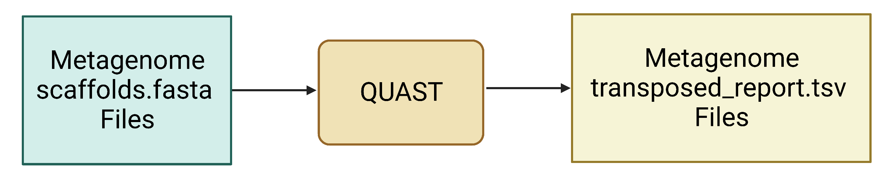

**Figure 3.** QUAST uses assembled contig or scaffold FASTA files as
input and generates a number of output files, including the
transposed_report.tsv file.

Example command for sample KGHS_1-0:

**\# Activate the QUAST conda environment.**

conda activate quast_env

**\# Run QUAST on the scaffolds.fasta file.**

quast.py --output-dir
metagenome_assemblies/KGHS_1-0/quast_contigs --threads 1
output/metagenome_assemblies/KGHS_1-0/contigs.fasta

**\# Run QUAST on the scaffolds.fasta file.**

quast.py --output-dir
metagenome_assemblies/KGHS_1-0/quast_scaffolds --threads 1
output/metagenome_assemblies/KGHS_1-0/scaffolds.fasta

Example output:

**QUAST contigs.fasta**

*less*
/bulk/IMCshared_bulk/kevin/module5/output/metagenome_assemblies/KGHS_1-0/quast_contigs/transposed_report.tsv

**QUAST scaffolds.fasta**

*less*
/bulk/IMCshared_bulk/kevin/module5/output/metagenome_assemblies/KGHS_1-0/quast_scaffolds/transposed_report.tsv

Table x: The QUAST evaluation metrics results for contigs.fasta and
scaffolds.fasta

| Assembly  | Number of contigs | Largest contig | Total length | GC (%) | N50   | \# N's per 100 kbp |
|-----------|-------------------|----------------|--------------|--------|-------|--------------------|
| contigs   | 29757             | 256891         | 5998229      | 36.61  | 28084 | 0                  |
| scaffolds | 29708             | 256891         | 6021946      | 36.64  | 29877 | 33.54              |

<u>Step 1c: Filter scaffolds \<1500 nt and evaluate change in assembly
quality using seqkit</u>

**seqkit** (<https://github.com/shenwei356/seqkit>)

seqkit will be used to filter the scaffolds\[5\], retaining those with a
minimum length of 1500 nt.

> *Most binning software recommends using 1500 nt scaffolds as the
> default. You can try using 2000 and 2500 to see how the resulting bins
> compare on your own time.*

**WARNING: Using scaffolds shorter than 1500 nt will result in the
tetranucleotide frequencies becoming poorly represented, yielding low
quality MAGs.**

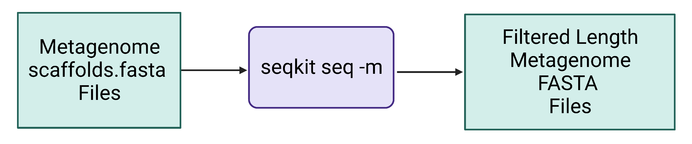

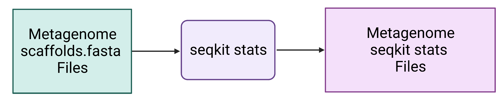

**Figure 4.** Seqkit seq uses assembled contig or scaffold FASTA files
as input and generates a new length-filtered contig or scaffold FASTA
file. Seqkit stats quickly/easily reports quality metrics and will be
applied to the original scaffolds.fasta file and the length-filtered
KGHS_1-0_min1500.fasta file to compare them.

Example command for sample KGHS_1-0:

**\# Filter scaffolds to a minimum length of 1500 nt.**

seqkit seq -m 1500
output/metagenome_assemblies/KGHS_1-0/scaffolds.fasta \>
filtered_metagenomes/KGHS_1-0/KGHS_1-0_min1500/KGHS_1-0_min1500.fasta

**\# Run seqkit stats on the KGHS_1-0 contigs.fasta file.**

seqkit stats -a
output/metagenome_assemblies/KGHS_1-0/contigs.fasta \>
metagenome_assemblies/KGHS_1-0/contigs.fasta.seqkit.stats.txt

Example output:

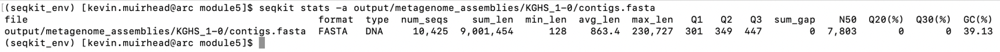

**\# Run seqkit stats on the KGHS_1-0 scaffolds.fasta file.**

seqkit stats -a
output/metagenome_assemblies/KGHS_1-0/scaffolds.fasta \>
metagenome_assemblies/KGHS_1-0/scaffolds.fasta.seqkit.stats.txt

Example output:

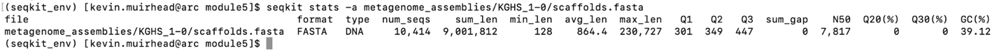

**\# Run seqkit with the stats option on the length-filtered
KGHS_1-0_min1500.fasta file to see how filtering affected the minimum
length reported and the number of scaffolds.**

seqkit stats -a
output/filtered_metagenomes/KGHS_1-0/KGHS_1-0_min1500.fasta \>
filtered_metagenomes/KGHS_1-0/KGHS_1-0_min1500.fasta.seqkit.stats.txt

Example output:

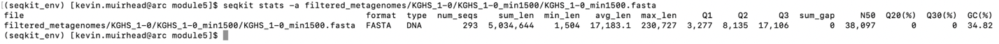

**Section 2: Binning**

<u>Step 2a: Bin scaffolds using at least 2 different algorithms</u>

Assembled scaffolds will be binned using two binning algorithms:
MetaBAT2\[6\] and MaxBin2\[7\]. Tetranucleotide frequency and abundance
(coverage) will be the scaffold attributes used by both algorithms.

> *You can read the following paper for more information and a
> comprehensive comparison of softwares for binning/bin refinement:
> (<https://bmcbioinformatics.biomedcentral.com/articles/10.1186/s12859-020-03667-3#Sec2>)*

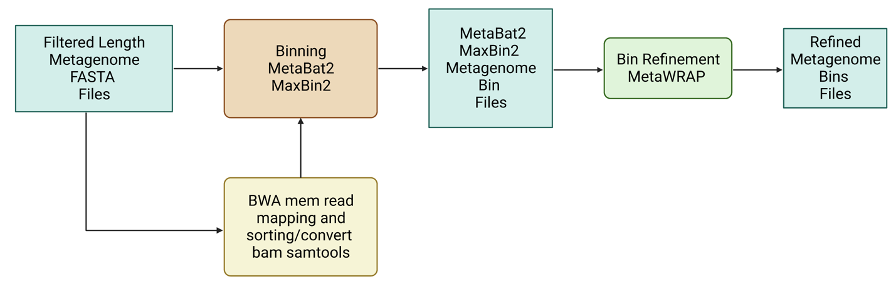

**Figure 5.** Length-filtered scaffold FASTA files are provided as input
for binning softwares such as MetaBat2 and MaxBin2. Read mapping files
(.bam) are also provided as input to the binning softwares. The outputs
of binning are smaller FASTA files, one for each bin. These are in turn
provided as input in the bin refinement step, producing the optimal set
of non-redundant bin FASTA files.

**bwa** (<https://github.com/lh3/bwa>)

**samtools** (<http://www.htslib.org>)

To generate the sample abundance data (a correlate of depth of coverage)
required by the binning algorithms, the clean paired end reads from each
sample have to be mapped to the assembled metagenome (1500 nt+ scaffolds
only). We used BWA\[8\] and samtools\[9\] to map the reads back to the
filtered metagenome.

**WARNING: DO NOT RUN BWA mem or samtools!!!** *Note: The mapping step
takes a few minutes using 14 threads.*

Example command for sample KGHS_1-0:

**\# Activate the bwa conda environment.**

conda activate bwa_env

**\# Create an index of the filtered scaffolds using bwa index.**

bwa index filtered_metagenomes/KGHS_1-0/KGHS_1-0_min1500.fasta

**\# Map the paired end reads from sample KGHS_1-0 to the filtered
scaffolds using bwa mem.**

bwa mem -t 1 filtered_metagenomes/KGHS_1-0/KGHS_1-0_min1500.fasta
cleaned_fastq_files/KGHS_1-0_1.fastq
cleaned_fastq_files/KGHS_1-0_2.fastq \>
filtered_metagenomes/KGHS_1-0/KGHS_1-0.sam

**\# Activate the samtools conda environment.**

conda activate samtools_env

**\# Sort the sam file and conver to bam using samtools.**

samtools sort -@ 1 -O BAM -o filtered_metagenomes/KGHS_1-0/KGHS_1-0.bam
filtered_metagenomes/KGHS_1-0/KGHS_1-0.sam

**MetaBat2** (<https://bitbucket.org/berkeleylab/metabat/src/master/>)

**MaxBin2** (<https://sourceforge.net/projects/maxbin2/>)

Example commands for sample KGHS_1-0:

**Bin length-filtered scaffolds using MetaBat2.**

**\# Activate the metabat2 conda environment.**

conda activate metabat2_env

**\# Create the initial binning KGHS_1-0 output directory.**

mkdir -p initial_binning/KGHS_1-0/

**\# Generate the metabat2 depth of coverage text file using the bam
file generated in the mapping step.**

jgi_summarize_bam_contig_depths --outputDepth
initial_binning/KGHS_1-0/metabat2_depth.txt
output/filtered_metagenomes/KGHS_1-0/KGHS_1-0.bam

**\# Create the initial binning working directory for metabat2.**

mkdir -p
initial_binning/KGHS_1-0/working_dir/metabat2 

**\# Run metabat on the filtered scaffolds using the metabat2 depth of
coverage file.**

metabat2 -i
output/filtered_metagenomes/KGHS_1-0/KGHS_1-0_min1500.fasta -a
initial_binning/KGHS_1-0/metabat2_depth.txt -o
initial_binning/KGHS_1-0/working_dir/metabat2/KGHS_1-0_bin -m 1500 -t 1
–unbinned

**\# Create the initial binning metabat2 directory for the KGHS_1-0
sample.**

mkdir -p initial_binning/KGHS_1-0/metabat2

**\# Copy the metabat2 bins to the initial binning metabat2 directory.**

cp
initial_binning/KGHS_1-0/working_dir/metabat2/KGHS_1-0_bin.\[0-9\]\*.fa
initial_binning/KGHS_1-0/metabat2

**Bin length-filtered scaffolds using MaxBin2.**

**\# Activate the metabat2 conda environment.**

conda activate metabat2_env

**\# Generate the maxbin2 depth of coverage text file using the bam file
generated in the mapping step.**

jgi_summarize_bam_contig_depths --outputDepth
initial_binning/KGHS_1-0/KGHS_1-0_maxbin2_depth.txt
--noIntraDepthVariance
output/filtered_metagenomes/KGHS_1-0/KGHS_1-0.bam

**\# Create the maxbin2 abundance file using the first and third columns
of the maxbin2 depth of coverage file.**

tail
-n+2 initial_binning/KGHS_1-0/KGHS_1-0_maxbin2_depth.txt \| cut -f1,3
\> initial_binning/KGHS_1-0/KGHS_1-0_maxbin2_abund.txt

**\# Print the path of the maxbin2 abundance file to a list file.**

echo initial_binning/KGHS_1-0/KGHS_1-0_maxbin2_abund.txt
\> initial_binning/KGHS_1-0/KGHS_1-0_maxbin2_abund_list.txt

**\# Activate the maxbin2 conda environment.**

conda activate maxbin2_env

**\# Create the working maxbin2 output directory.**

mkdir
-p initial_binning/KGHS_1-0/working_dir/maxbin2

**\# Run MaxBin2 using the filtered scaffolds fasta file and the maxbin2
abundance list.**

perl software_dir/MaxBin-2.2.7/run_MaxBin.pl
-contig output/filtered_metagenomes/KGHS_1-0/KGHS_1-0_min1500.fasta
-markerset 107 -thread 14 -min_contig_length 1500 -out
initial_binning/KGHS_1-0/working_dir/maxbin2/KGHS_1-0_bin -abund_list
initial_binning/KGHS_1-0/KGHS_1-0_maxbin2_abund_list.txt

**\# Create the maxbins2 output directory so we can rename the bins so
metawrap can use them as input.**

mkdir -p initial_binning/KGHS_1-0/maxbin2

**\# Rename bins and copy the maxbin2 bins to the maxbin2 bin
directory.**

for bin_file in \$(ls
initial_binning/KGHS_1-0/working_dir/maxbin2 \| grep "\\fasta");

do echo \$bin_file;

filename=\$(basename \$bin_file '.fasta');

bin_num=\$(echo \$filename \| sed -r
"s/KGHS_1-0_bin\\0+//g");

echo \$bin_num;

new_filename="KGHS_1-0_bin.\${bin_num}.fa";

echo \$new_filename;

cp
initial_binning/KGHS_1-0/working_dir/maxbin2/\$bin_file
initial_binning/KGHS_1-0/maxbin2/\$new_filename;

done

Example output:

**Table 2:** Number of bins from MetaBAT2 and MaxBin2.

| Binning Program | Bin ID            |     |     |     |     |
|-----------------|-------------------|-----|-----|-----|-----|
| MetaBAT2        | KGHS_1-0_bin.1.fa |     |     |     |     |
| MetaBAT2        | KGHS_1-0_bin.2.fa |     |     |     |     |
| MetaBAT2        | KGHS_1-0_bin.3.fa |     |     |     |     |
| MaxBin2         | KGHS_1-0_bin.1.fa |     |     |     |     |
| MaxBin2         | KGHS_1-0_bin.2.fa |     |     |     |     |
| MaxBin2         | KGHS_1-0_bin.3.fa |     |     |     |     |
| MaxBin2         | KGHS_1-0_bin.4.fa |     |     |     |     |
| MaxBin2         | KGHS_1-0_bin.5.fa |     |     |     |     |
| MaxBin2         | KGHS_1-0_bin.6.fa |     |     |     |     |
| MaxBin2         | KGHS_1-0_bin.7.fa |     |     |     |     |

Should we keep? I don’t have checkm or quast for this but can run it
later ^^^^

<u>Step 2b: Refine bins using metaWRAP’s bin refinement module</u>

**metaWRAP bin_refinement module** (<https://github.com/bxlab/metaWRAP>)

MetaWRAP uses CheckM to optimize the quality of bins. It takes up to 3
different sets of bins at a time. Since you are using two binning
algorithms, you will specify the -A and -B parameter options. If you
used a third, you would add the -C option.

**WARNING: DO NOT RUN metaWRAP!!!**

Since metawrap uses checkm and it takes quite a bit of time to complete.
We precomputed the refined bins taking 31 minutes using 28 threads and
34 GB.

Example commands for sample KGHS_1-0 bins:

**\# Start the conda environment for metaWRAP bin_refinement.**

conda activate metawrap_bin_refinement_env

**\# Run the metawrap bin refinement module.**

metawrap bin_refinement -o bin_refinement/KGHS_1-0 -t 1 -A
initial_binning/KGHS_1-0/metabat2 -B initial_binning/KGHS_1-0/maxbin2 -c
50 -x 10

Example output:

Obtained from quast output transposed_report.tsv for KGHS_1-0_bin.1 and
KGHS_1-0_bin.3.

**Table 3**: Number of bins refined using metaWRAP.

| **Bin ID**     | **Refined Bin Program** | **Number of contigs** | **Largest contig** | **Total length** | **GC (%)** | **N50** | **\# N's per 100 kbp** |
|----------------|-------------------------|-----------------------|--------------------|------------------|------------|---------|------------------------|
| KGHS_1-0_bin.1 | metaWRAP                | 75                    | 133687             | 1711736          | 34.19      | 67177   | 6.43                   |
| KGHS_1-0_bin.3 | metaWRAP                | 136                   | 59107              | 1593681          | 37.33      | 17642   | 7.53                   |

<u>Step 2c: Evaluate bin quality using CheckM</u>

You will now evaluate the quality of your bins to determine which are
suitable for downstream analyses as metagenome assembled genomes (MAGs).

> *CheckM requires a larger amount of RAM because of pplacer. We ran the
> checkm command prior to this tutorial because it takes 13 mins using
> 14 threads and 30 GB RAM per MAG.*

**CheckM** (<https://github.com/Ecogenomics/CheckM>)

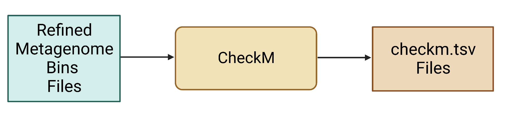

**Figure 6.** Refined bin FASTA files are provided as input for CheckM,
which produces a variety of output files, including different .tsv files
that contain various data summaries. Note that some .tsv files may not
be produced unless specified using the appropriate parameter.

**WARNING Do not run CheckM as it takes 10 mins using 14 threads and x
GB of RAM memory. It will take considerably longer with less threads and
will run into memory issues using AWS instance resources as it requires
more than 16 GB of memory.**

**WARNING: Before running CheckM we would need to set the path to the
CheckM database. If you don’t set the database, or have proper user
permissions to read the database, CheckM will print an error message
until you run out of space on your hard drive. So be aware of this as it
could potentially give you a lot of problems you don’t need.**

Example command for the KGHS_1-0.bin1.fa MAG:

**\# Set the CheckM database path.**

echo "software_dir/checkm_data_dir" \| checkm data setRoot

**\# Copy the bin and rename to KGHS_1-0.bin1 so that we can run
checkm.**

cp bin_refinement/KGHS_1-0/metawrap_50_10_bins/bin.1.fa
refined_bins/KGHS_1-0/KGHS_1-0_bin.1/checkm/KGHS_1-0_bin.1.fa

**\# Activate the checkm conda environment.**

conda activate checkm_env

**\# Run CheckM to assess the quality of the KGHS_1-0.bin1.fa MAG.**

checkm lineage_wf -t 14 -x fa --tab_table --file
refined_bins/KGHS_1-0/KGHS_1-0_bin.1/checkm/checkm.tsv
refined_bins/KGHS_1-0/KGHS_1-0_bin.1/checkm
refined_bins/KGHS_1-0/KGHS_1-0_bin.1/checkm

Example output:

less
/home/ubuntu/CourseData/MIC_data/mags_workshop/module5/output/refined_bins/KGHS_1-0/KGHS_1-0/KGHS_1-0_bin.1/checkm/checkm.tsv

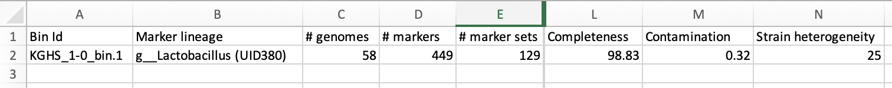

These are the most important columns from CheckM.

**Bin Id** – The ID of the MAG.

**\# genomes** – Number of genomes predicted in the MAG.

**Completeness** – The percent of universal single copy marker genes
present in the MAG.

**Contamination** – The percent of contamination found in your MAG.

**WARNING: CheckM does not provide an accurate taxonomic classification
of the MAGs – do not consider what is reported by this program as the
final assignment. This is because it is giving the best classification
based on the percent completeness of universal single copy genes and the
percent contamination of other genomes. GTDB-tk gives a more accurate
classification (Section 3, Step 3a below).**

Exercise:

\# Use awk to filter the CheckM results using \>= 50% completeness and
\<=10 % contamination.

awk -F’\t’ ‘((\$1 \>= 50) && (\$2 \<= 10)){print
\$0}’ \<(tail -n+2 \< checkm.tsv) \>
checkm_output_ge50comp_le10contam.tsv

\# Use awk to filter the CheckM results using \>= 90% completeness and
\<=10 % contamination.

awk -F’\t’ ‘((\$1 \>= 90) && (\$2 \<= 10)){print
\$0}’ \<(tail -n+2 \< checkm.tsv) \>
checkm_output_ge90comp_le10contam.tsv

**Section 3: Annotation**

For the purposes of this tutorial, you will consider refined bins with
\>= 90% completeness and \<= 10% contamination (CheckM) as MAGs suitable
for downstream annotation.

<u>Step 3a: Classify the taxonomy of each MAG using GTDB-tk</u>

**GTDB-tk** (<https://github.com/Ecogenomics/GTDBTk>)

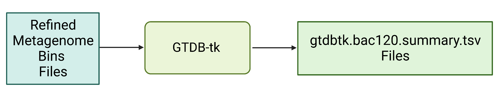

**Figure 7.** Refined bin FASTA files are provided as input for GTDB-tk,
which produces a summary .tsv file with the full taxonomic string and
other information about the annotation process.

GTDB-tk is used to classify the taxonomy of your MAGs\[10\]. *If you
give GTDB-tk a heavily contaminated MAG or metagenomic assembly, it will
fail.*

**WARNING Do not run GTDB-tk!!! *Note It requires pplacer and will take
20 mins using 46 GB RAM and 14 threads.***

Example command for the KGHS_1-0.bin1.fa MAG:

**\# Activate the gtdbtk conda environment.**

conda activate gtdbtk_env

**\# Export the location of the gtdbtk database after it is installed.**

export
GTDBTK_DATA_PATH="/bulk/IMCshared_bulk/kevin/module5/software_dir/release207_v2"

**\# Copy the KGHS_1-0_bin.1.fa MAG to the gtdbtk directory.**

cp bin_refinement/KGHS_1-0/metawrap_50_10_bins/bin.1.fa
refined_bins/KGHS_1-0/KGHS_1-0_bin.1/gtdbtk/KGHS_1-0_bin.1.fa

**\# Run the gtdbtk command on the KGHS_1-0_bin.1.fa MAG**

gtdbtk classify_wf --genome_dir
refined_bins/KGHS_1-0/KGHS_1-0_bin.1/gtdbtk --extension "fa" --cpus 14
--out_dir refined_bins/KGHS_1-0/KGHS_1-0_bin.1/gtdbtk

**Example output:**

less
/home/ubuntu/CourseData/MIC_data/mags_workshop/module5/output/refined_bins/KGHS_1-0/KGHS_1-0/KGHS_1-0_bin.1/gtdbtk/gtdbtk.bac120.summary.tsv

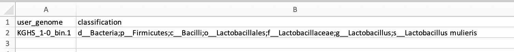

**user_genome** – The ID of the MAG.

**classification** – The GTDB-tk taxonomy classification of the MAG.

**Question**: What is the taxonomy of this MAG?

<u>Step 3b: Annotate the genes in each MAG using Prokka</u>

During the in-class tutorial you will call open reading frames and
annotate gene functions using Prokka. Prokka is a quick annotation
pipeline that only uses a fraction of the databases that more
comprehensive pipelines like DRAM use.

**Prokka** (<https://github.com/tseemann/prokka>)

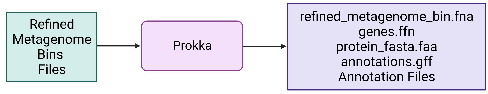

**Figure 7.** Refined bin FASTA files are provided as input for Prokka,
which produces a variety of output files, including gene and protein
multi-FASTA files.

Example command for the KGHS_1-0.bin1.fa MAG:

**\# Activate the conda environment.**

conda activate prokka_env

**\# Rename and copy the KGHS_1-0_bin.1.fa MAG to the refined_bins
KGHS_1-0_bin.1 prokka directory.**

cp bin_refinement/KGHS_1-0/metawrap_50_10_bins/bin.1.fa
refined_bins/KGHS_1-0/KGHS_1-0_bin.1/prokka/KGHS_1-0_bin.1.fa

**\# Run prokka on the KGHS_1-0_bin.1.fa MAG.**

prokka --metagenome --outdir refined_bins/KGHS_1-0/KGHS_1-0_bin.1/prokka
--prefix KGHS_1-0_bin.1
refined_bins/KGHS_1-0/KGHS_1-0_bin.1/prokka/KGHS_1-0_bin.1.fa --cpus 14
--rfam 1 –force

Example output:

**KGHS_1-0_bin.1.ffn** – The annotated genes FASTA file containing
rRNAs, tRNAs, CDS, ncRNAs, etc.

less
/home/ubuntu/CourseData/MIC_data/mags_workshop/module5/output/refined_bins/KGHS_1-0/KGHS_1-0/KGHS_1-0_bin.1/prokka
/KGHS_1-0_bin.1.ffn

**KGHS_1-0_bin.1.faa** – The protein FASTA file annotated CDS gene
sequences translated to proteins.

less
/home/ubuntu/CourseData/MIC_data/mags_workshop/module5/output/refined_bins/KGHS_1-0/KGHS_1-0/KGHS_1-0_bin.1/prokka
/KGHS_1-0_bin.1.faa

**KGHS_1-0_bin.1.gff** – The generic feature format (GFF) file that
contains all the annotated MAG sequence information including start and
end position, reading frame, functional annotation, annotation
description, etc.

less
/home/ubuntu/CourseData/MIC_data/mags_workshop/module5/output/refined_bins/KGHS_1-0/KGHS_1-0/KGHS_1-0_bin.1/prokka
/KGHS_1-0_bin.1.gff

**DRAM** (<https://github.com/WrightonLabCSU/DRAM>)

Although you will not execute DRAM as part of the in-class tutorial, we
will provide you with example commands and we will compare the
pre-computed output files to those generated by Prokka.

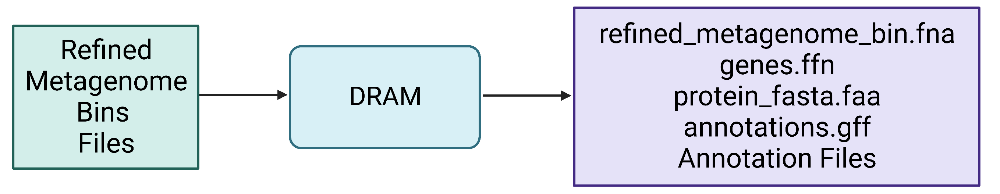

**Figure 8.** Refined bin FASTA files are again provided as input for
DRAM, which produces a variety of output files, including gene and
protein multi-FASTA files.

**WARNING: DO NOT RUN DRAM on the AWS instance! The databases it
requires were too large to allow it to be installed and ran within this
tutorial.**

> *The DRAM database requires 500–700GB of storage and installing the
> DRAM database on a high-performance computing cluster at the
> University of Calgary required 32 threads and 375GB of RAM taking a
> day and a half to complete.*

Example commands for the KGHS1-0.bin1.fa MAG:

**\# Activate the conda environment.**

conda activate dram_env

**\# Prepare the DRAM databases.**

DRAM-setup.py prepare_databases --threads 32 --output_dir
/path/to/dram_database

**\# Execute the DRAM annotation command.**

DRAM.py annotate -i bin_refinement/KGHS_1-0/metawrap_50_10_bins/bin.1.fa
-o refined_bins/KGHS_1-0/KGHS_1-0_bin.1/dram 

**\# Execute the DRAM distill command.**

DRAM.py distill -i
refined_bins/KGHS_1-0/KGHS_1-0_bin.1/dram/annotations.tsv -o
refined_bins/KGHS_1-0/KGHS_1-0_bin.1/dram/genome_summaries --trna_path
refined_bins/KGHS_1-0/KGHS_1-0_bin.1/dram/trnas.tsv --rrna_path
refined_bins/KGHS_1-0/KGHS_1-0_bin.1/dram/rrnas.tsv

Both steps took 26 minutes together for the KGHS_1-0_bin.1 MAG using 10
threads as it uses 10 threads as the default if you do not specify the
–threads parameter.

Example output:

less
/home/ubuntu/CourseData/MIC_data/mags_workshop/module5/output/refined_bins/KGHS_1-0/KGHS_1-0_bin.1/dram/annotations.tsv

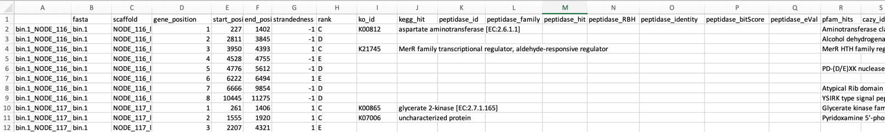

Open the
/home/ubuntu/CourseData/MIC_data/mags_workshop/module5/output/refined_bins/KGHS_1-0/KGHS_1-0/KGHS_1-0_bin.1/dram/genome_summaries/product.html
in a browser window i.e. chrome

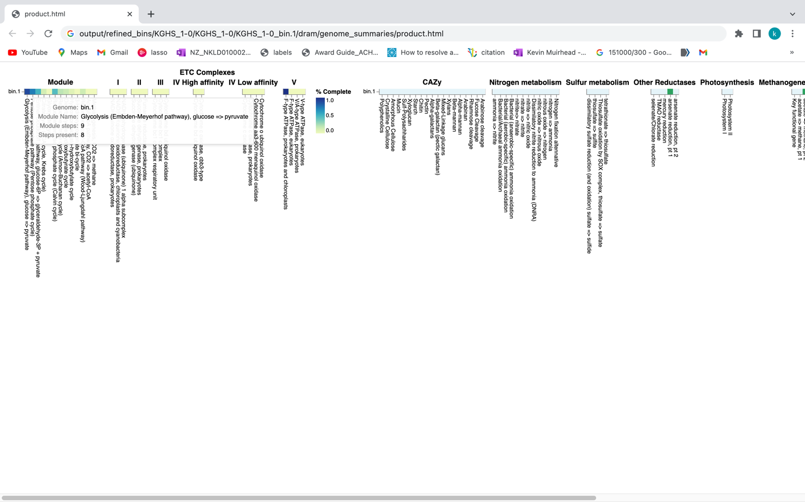

**Exercise**:

**Question**: How many pentose phosphate pathway steps are found within
the KGHS_1-0_bin.1.fa MAG?

Compare the results of Prokka versus DRAM. Both use Prodigal
(<https://github.com/hyattpd/Prodigal>) for calling open reading frames
(ORFs), Barrnap (<https://github.com/tseemann/barrnap>) to identify 5S,
23S,16S rRNA genes. DRAM uses tRNAscan-SE
(<http://lowelab.ucsc.edu/tRNAscan-SE/>) to search for t-RNA gene
prediction and Prokka uses Aragorn (<http://www.ansikte.se/ARAGORN/>)
for t-RNA gene prediction. DRAM and Prokka use a different combination
of databases for annotation of protein coding genes resulting in
different naming of each sequence ID and the annotation given.

**Table 4**: Overview of the programs used in the DRAM and Prokka
annotation software.

| **Program Name** | **ORF caller** | **rRNA Prediction** | **t-RNA Prediction** | **Databases**                                                                                        |
|------------------|----------------|---------------------|----------------------|------------------------------------------------------------------------------------------------------|
| DRAM             | Prodigal       | Barrnap             | trnascan             | UniRef90, PFAM, dbCAN, RefSeq viral, VOGDB and the MEROPS peptidase database                         |
| Prokka           | Prodigal       | Barrnap             | ARAGORN              | ISFinder, NCBI Bacterial Antimicrobial Resistance Reference Gene Database, and UniProtKB (SwissProt) |

Both have similar output file types yet DRAM uses quite a few more
databases giving better annotations for your MAGs. There are many other
types of annotation software out there, but not all software annotate
every possible type of sequence with the type of information that you
might be looking for. Therefore, you may need to run other software to
obtain the types of annotations that you are interested in.

**Exercises**:

**Question**: How many “hypothetical” proteins are there within the bins
annotated using Prokka? How many using DRAM?

**Question**: How many coding sequences (CDS) did Prokka annotate versus
DRAM?

**Question**: Do all the MAGs have a chaperonin 60 (*cpn60*) protein
coding gene? This is an alternative marker gene to 16S rRNA that is used
in many microbial ecology studies. How about the 16S rRNA gene? *Hint:
The cpn60 gene in Prokka can be searched using synonyms such as GroL and
chaperonin 60 kDa. You can search 16S Ribosomal RNA in prokka. If you
cross reference the gene ID in prokka to the one found in DRAM using the
scaffold ID found in the prokka GFF file to the annotations.tsv file
found in DRAM*.

**Question**: Find a GH68 Levansucrase carbohydrate active enzyme
(CAZyme) in the DRAM annotations.tsv file. Compare it to the annotation
found in Prokka. *Hint: Search for GH68 or “Levansucrase” in the DRAM
annotations.tsv file. Find a scaffold ID that will link to the
annotation in Prokka.*

<u>Step 3c: Annotate structural features – in this case mobile elements
– of MAGs using mobileOG-db</u>

**mobileOG-db** (<https://github.com/clb21565/mobileOG-db>)

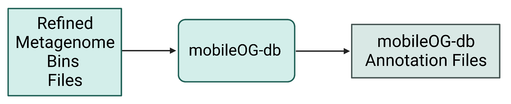

**\# Run diamond on the mobileOG-db.**

diamond blastp -q
refined_bins/KGHS_1-0/KGHS_1-0_bin.1/prokka/KGHS_1-0_bin.1.faa --db
/bulk/IMCshared_bulk/shared/dbs/mobileOG-db/mobileOG-db-beatrix-1.6.dmnd
--outfmt 6 stitle qseqid pident bitscore slen evalue qlen sstart send
qstart qend -o
refined_bins/KGHS_1-0/KGHS_1-0_bin.1/mobileog_db/KGHS_1-0_bin.1.tsv
--threads 14 -k 15 -e 1e-20 --query-cover 80 --id 30

**\# Run the mobileOG-db script for parsing the output and merging the
metadata for extra information.**

python software_dir/mobileOG-db/mobileOG-pl/mobileOGs-pl-kyanite.py --o
refined_bins/KGHS_1-0/KGHS_1-0_bin.3/mobileog_db/annotation --i
"refined_bins/KGHS_1-0/KGHS_1-0_bin.3/mobileog_db/KGHS_1-0_bin.3.tsv" -m
/bulk/IMCshared_bulk/shared/dbs/mobileOG-db/mobileOG-db-beatrix-1.6-All.csv

Example output:

less
/home/ubuntu/CourseData/MIC_data/mags_workshop/module5/output/refined_bins/KGHS_1-0/KGHS_1-0/KGHS_1-0_bin.1/mobileog_db
/annotation.mobileOG.Alignment.Out.csv

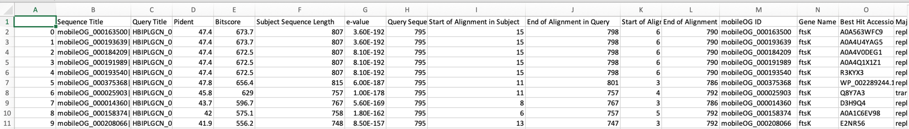

You can expect to find the follow types of mobile elements;

- **Insertion sequences (IS)** - small pieces of DNA which move within
  or between genomes using their own specialized recombination systems.
  i.e. transposons

- **Integrative genomic elements (IGEs)** - mobile multigene DNA units
  that integrate into and excise from host bacterial genomes.

- **Plasmids** - small circular extrachromosomal DNA molecules that
  replicate and are transmitted independent from chromosomal DNA.

- **Phages** – bacteriophage genome that is integrated into the circular
  bacterial chromosome or exists as an extrachromosomal plasmid within
  the bacterial cell.

Open the mobileOG-db annotation.mobileOG.Alignment.Out.csv and
annotation.summary.csv output files to answer the following questions.

**Question**: How many IS, IGE, plasmid and/or phage sequences are in
the KGHS_1-0_bin.1.fa MAG? *Hint: Look in the annotation.summary.csv
file.*

**Question**: Compare the annotation output of mobileOG-db to prokka.
What did prokka and mobileOG-db annotate these protein sequences as?
*Hint: You can use the grep command to search the the annotations from
mobileOG-db using the locus tag ids and grab the prokka protein fasta
file.*

**Appendix**

**Appendix Section 1: Downloading SRA datasets**

The dataset was downloaded from bioproject ID PRJNA838641 using the
SraRunInfo.csv file when in the SRA list.

<https://www.ncbi.nlm.nih.gov/bioproject/PRJNA838641>

If you scroll down to the SRA Experiments section shown in the following
screenshot, you will see the link labelled 17 which will take you to the
SRA experiment page. For your convenience we have provided the following
link
(<https://www.ncbi.nlm.nih.gov/sra?linkname=bioproject_sra_all&from_uid=838641>)

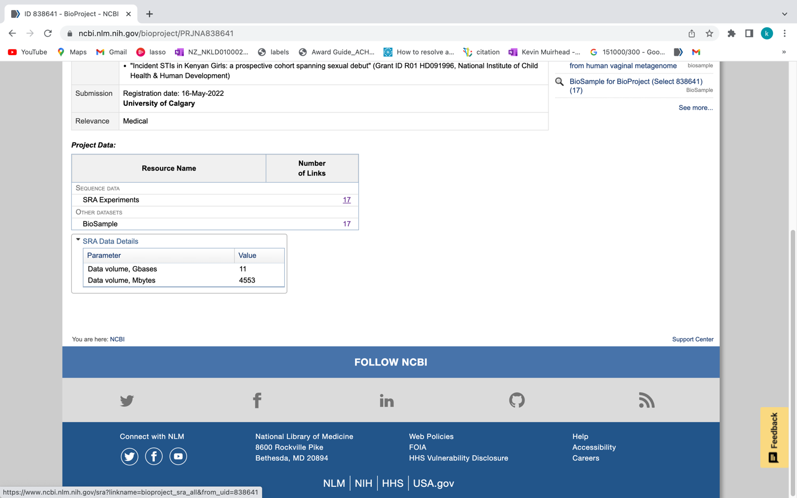

Once you are at the following page you can click on the “Send to:” drop
down menu and select “File”, then the Format drop down menu and select
“RunInfo” and click “Create File”. This will download a file called
“SraRunInfo.csv” which lists each SRA entry for the KGHS Pilot Dataset
with each having an SRA Run ID and a sample name in the file that we can
use to download each shotgun metagenome paired end read set using the
fasterq-dump program within the NCBI SRA toolkit.

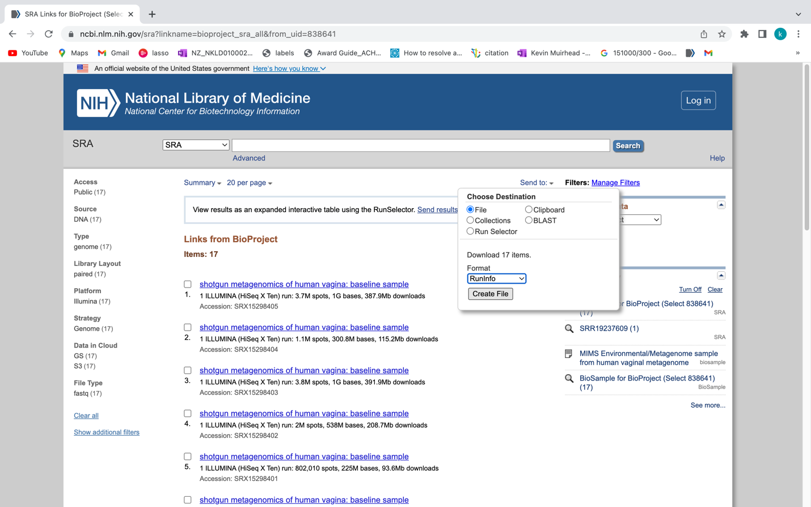

We can then use the “SraRunInfo.csv” file to download each sample using
fasterq-dump if we wanted. An example shell script
“download_sra_dataset.sh” has been provided in github.com so that you
can use it to download public shotgun metagenomics datasets from NCBI to
use in your research. You can do this on your own time if you are
interested in incorporating public NCBI SRA datasets to your research
using a NBCI BioProject ID from a paper related to your work.

For the purpose of this tutorial we have selected a subset of the data
with four samples so that you can follow along before applying what you
have learned to larger public datasets. We used the shell script
“download_sra_subsampled_dataset.sh” to download the four samples we
selected. An example of the fasterq-dump command is shown below. The
command is set to use 4 threads to make the process a bit faster. The
output file name is specified as the sample name KGHS_8-0 and the output
directory is specified cleaned_fastq_files. The –split-files option
converts the SRA to fastq files automatically, and splits the reads into
read 1 and read 2 files.

Example command:

fasterq-dump --threads 4 --outfile KGHS_1-0 --outdir cleaned_fastq_files
--split-files SRR19237623

**Appendix 2: Shell scripts and slurm job array submission scripts.**

We made the shell scripts available as examples of how to run these
scripts in a more high-throughput fashion. If you have a
high-performance computing (HPC) cluster running SLURM to submit jobs we
supplied shell scripts and job array sbatch scripts for your use
following all four samples detailed in this tutorial. If you do not have
access to a HPC cluster using SLURM we have also provided the same
scripts using a for loop to iterate over the sample and binned MAGs for
each sample depending on the command instead of job arrays for your
convenience. Please go to the bioinformatics.ca github repository to
download these scripts for your use. Follow the instructions there for
how to install the conda environments, databases and running the
scripts.

Link to scripts here.

**Appendix 3: Extra annotation programs and examples.**

**Step 3: Annotate MAG using eggnog-mapper**

eggnog-mapper (<https://github.com/eggnogdb/eggnog-mapper>)

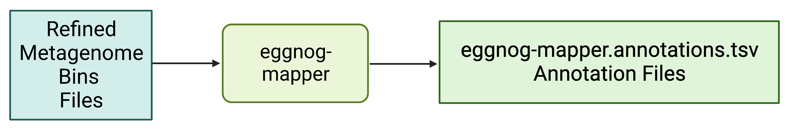

The eggnog-mapper program annotates a protein fasta file using the
following databases.

Example Command:

**\# Activate the eggnog_mapper conda environment.**

conda activate eggnog_mapper_env

**\# Run the eggnog-mapper annotation command using the prokka protein
fasta file as input.**

python path/to/software_dir/eggnog-mapper/emapper.py -i
refined_bins/KGHS_1-0/KGHS_1-0_bin.1/prokka/KGHS_1-0_bin.1.faa --itype
proteins --cpu 14 --data_dir
/bulk/IMCshared_bulk/shared/shared_software/eggnog-mapper/data --output
refined_bins/KGHS_1-0/KGHS_1-0_bin.1/eggnog_mapper/KGHS_1-0_bin.1

Example output:

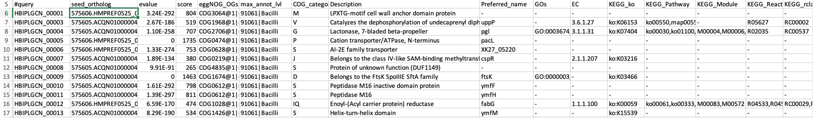

less
/home/ubuntu/CourseData/MIC_data/mags_workshop/module5/output/refined_bins/KGHS_1-0/KGHS_1-0/KGHS_1-0_bin.1/eggnog_mapper/KGHS_1-0_bin.1.emapper.annotations

**\#query** – The Query Name

**seed_ortholog** - The seed ortholog ID

**evalue** – The seed ortholog e-value

**score** - The seed ortholog bit score

**eggNOG_OGs** - a comma-separated, clade depth-sorted (broadest to
narrowest), list of Orthologous Groups (OGs) identified for this query.
Note that each OG is represented in the following
format: *OG@tax_id\|tax_name*

**max_annot_lvl** - tax_id\|tax_name of the level of widest OG used to
retrieve orthologs for annotations.

**COG_category** - COG category of the narrowest OG with a valid one.

**Description** - Description of the narrowest OG with a valid one.

**Preferred_name**

**GOs** – Gene Ontology IDs

**EC** – Enzyme Class Number

**KEGG_ko** – KEGG ko ID

**KEGG_Pathway** – KEGG pathway ID

**KEGG_Module** – KEGG Module ID

**KEGG_Reaction** – KEGG reaction ID

**KEGG_rclass** – KEGG rclass information.

**BRITE** – KEGG BRITE ID

**KEGG_TC** – KEGG TC

**CAZy** – The carbohydrate active enzyme annotation (cazy.org)

**BiGG_Reaction** -

**PFAMs** – PFAM IDs

**Question**: How does eggnog-mapper compare to the results of DRAM? Did
we annotate the same number of CDS sequences? Are the annotations named
the same? *Hint: Since we are starting with the prokka protein fasta
file .faa the sequence IDs will be different but using the annotations
you can figure out what scaffold they came from and the start and end
positions of the open reading frames.*

**Step 4: Annotate MAGs using dbCAN**

run_dbCAN4 (<https://github.com/linnabrown/run_dbcan>)

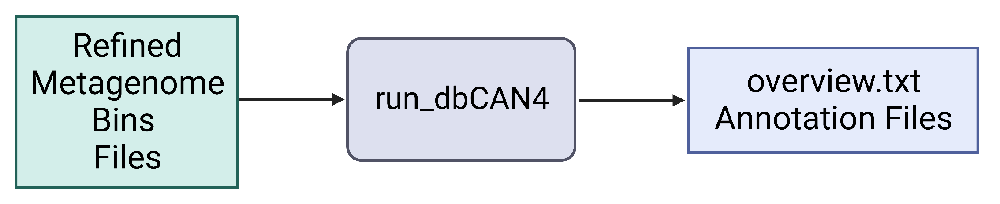

The run_dbcan software annotates a protein fasta file with carbohydrate
active enzymes\[11\]. run_dbcan4 is a new version that uses eCAMI HMM
models to obtain the enzyme class number (EC#) to predict the substrate
a CAZyme.

**\# Activate the run_dbcan conda environment.**

conda activate run_dbcan_env

**\# Run the run_dbcan command.**

run_dbcan refined_bins/KGHS_1-0/KGHS_1-0_bin.1/prokka/KGHS_1-0_bin.1.faa
protein --db_dir
/bulk/IMCshared_bulk/kevin/module5/software_dir/run_dbcan_database
--dia_cpu 14 --hmm_cpu 14 --dbcan_thread 14 --out_dir
refined_bins/KGHS_1-0/KGHS_1-0_bin.1/dbcan

less
/home/ubuntu/CourseData/MIC_data/mags_workshop/module5/output/refined_bins/KGHS_1-0/KGHS_1-0_bin.1/dbcan/overview.txt

Example output from overview.txt. Open the KGHS_1-0_bin.1 overview.txt
file using the less command. You will see the following columns. One row
for each CAZyme classified.

**Gene ID** – The prokka locus tag

**EC#** - The enzyme class number (if present)

**HMMER** – The results from the dbcan HMM model.

**dbCAN_sub** – The dbcan substrate prediction using the eCAMI kmer HMM
model. Reports the CAZyme family and the substrate ID.

**DIAMOND** – The DIAMOND results from the dbcan protein fasta database.

**\#ofTools** - The number of tools that annotated this Gene ID

**Excercises**:

**Question**: How does the CAZy results in eggnog-mapper compare to the
results given by run_dbCAN4?

**Question**: How does the CAZy results in DRAM compare to the results
of run_dbCAN4?

**Question**: How do you search for the details of a CAZyme family on
the Carbohydrate-Active enZYmes Database site (<http://www.cazy.org/>)?
*Hint: Use the search bar with the “Family” dropdown box.*

**References**

1\. Prjibelski, A., et al., *Using SPAdes De Novo Assembler.* Current
Protocols in Bioinformatics, 2020. **70**(1): p. e102.

2\. Gurevich, A., et al., *QUAST: quality assessment tool for genome
assemblies.* Bioinformatics, 2013. **29**(8): p. 1072-1075.

3\. Peng, Y., et al., *IDBA-UD: a de novo assembler for single-cell and
metagenomic sequencing data with highly uneven depth.* Bioinformatics,
2012. **28**(11): p. 1420-1428.

4\. Li, D., et al., *MEGAHIT: an ultra-fast single-node solution for
large and complex metagenomics assembly via succinct de Bruijn graph.*
Bioinformatics, 2015. **31**(10): p. 1674-1676.

5\. Shen, W., et al., *SeqKit: A Cross-Platform and Ultrafast Toolkit
for FASTA/Q File Manipulation.* PLOS ONE, 2016. **11**(10): p. e0163962.

6\. Kang, D.D., et al., *MetaBAT 2: an adaptive binning algorithm for
robust and efficient genome reconstruction from metagenome assemblies.*
PeerJ, 2019. **7**: p. e7359.

7\. Wu, Y.-W., B.A. Simmons, and S.W. Singer, *MaxBin 2.0: an automated
binning algorithm to recover genomes from multiple metagenomic
datasets.* Bioinformatics, 2015. **32**(4): p. 605-607.

8\. Li, H., *Aligning sequence reads, clone sequences and assembly
contigs with BWA-MEM.* arXiv: Genomics, 2013.

9\. Li, H., et al., *The Sequence Alignment/Map format and SAMtools.*
Bioinformatics, 2009. **25**(16): p. 2078-2079.

10\. Chaumeil, P.-A., et al., *GTDB-Tk: a toolkit to classify genomes
with the Genome Taxonomy Database.* Bioinformatics, 2019. **36**(6): p.
1925-1927.

11\. Zhang, H., et al., *dbCAN2: a meta server for automated
carbohydrate-active enzyme annotation.* Nucleic Acids Research, 2018.
**46**(W1): p. W95-W101.
